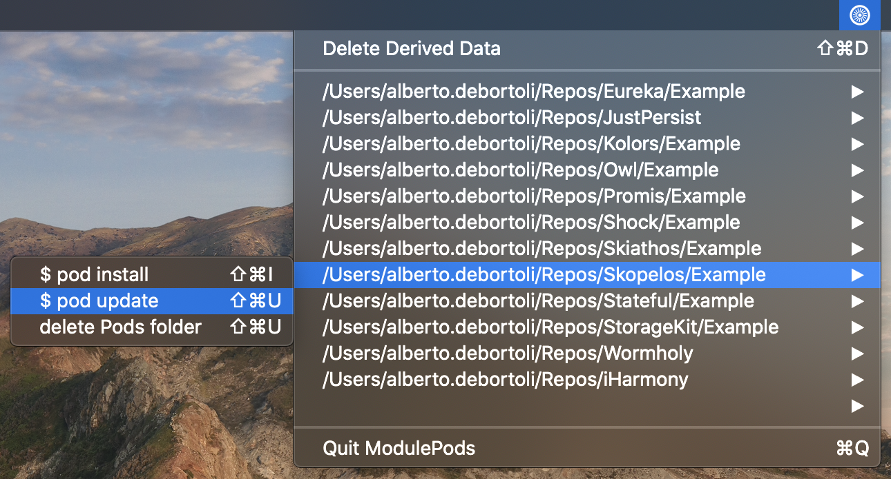

# README

## What is this?

At Just Eat we have a plethora of private pods used to build the main consumer iOS app. Since CocoaPods is, a the time of writing, at the core of our stack, it's very common to jump between pods (we call them 'modules') and run the classic `$ pod install` or `$ pod update` commands very often. The idea behind `ModulePods` is to ease these operations avoiding the annoyance of going back and forth to the terminal.
Other common operations such as `$ bundle update`, deleting the `Pods` or the `DerivedData` folders should also be just 1 click away.

The tool appears in the mac toolbar showing all the pods in a given path having an example app.

`ModulePods` is by no means final. You know that pet project we all have, started with motivation and then slowly let die? Here is one of mine 🙃 created on a cloudy Saturday afternoon at [Caffè Nero](https://www.google.co.uk/maps/place/Caff%C3%A8+Nero/@51.4435697,-0.1526865,17.58z/data=!4m5!3m4!1s0x487605cf797fcf67:0x34d274b6a3b7e263!8m2!3d51.4445044!4d-0.1517775) ☕️ where the majority of the time was spent trying to understand how to use the quite arcane [`NSTask`/`Process` API](https://developer.apple.com/documentation/foundation/nstask).
So I thought of simply open-source it as it is. I know I'll never fully complete it due to the usual lack of time + my priorities changed since I originally started it. Feel free to take it and complete it or simply use it as it is (you'll have to adjust it a bit for your needs).

A similar tool exists already, [https://cocoapods.org/app](https://cocoapods.org/app) but it's not under active development and not greatly maintained as far as I can see.

## Todo

For every project with Podfile, script for:
- Bundle install
- Bundle udpate
- Pod install
- Pod update
- Git actions
- parametrize the input folder

## Icons
https://icons8.com/icon/set/mac/ios-glyphs
